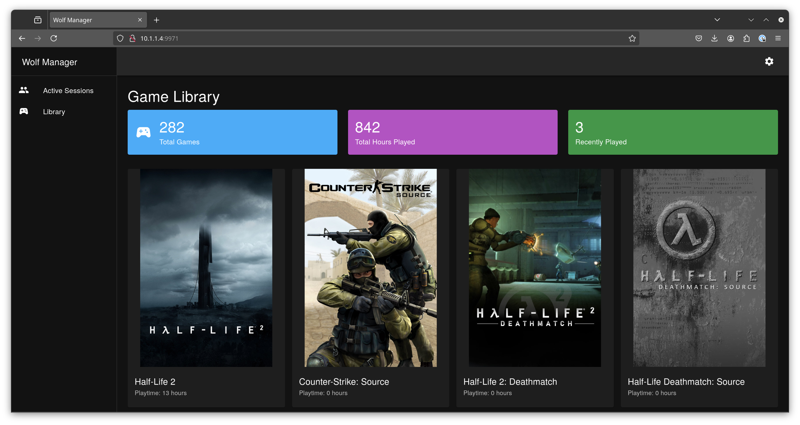

# wolfmanager
A web interface for managing Wolf, currently in development and does very little other than the following

- fetch list of your steam games
- fetch game artwork from steamgriddb

Here are some screenshots of the current state of the project

# TODO

## Game Management
- [ ] Add method for installing games using SteamCMD or scanning existing install library
- [ ] Add installed game into Wolf Configured apps along with game artwork and direct launch for steam

## Wolf Management
- [ ] Expose wolf api to frontend
- [ ] display active wolf sessions
- [ ] add / remove client pairing

## Security
- [ ] Create admin user with auth and admin only functions
- [ ] Add user management, this would just create a user state folder and point all pair clients to that user dir.

## Other
= [ ] Publish the Bruno API collection I created to diagnose, research

# Wishful Thinking
- [ ] Have wolf manager detect and create the wolf stack it manages
- [ ] Implement additional game libraries

# Known Issues
- Some artwork does not display for games, need a method for manually searching.
- It literally does nothing yet other than chew watts and look sorta pretty and as such have not implemented real features.

# FAQ
- Q: How does tis help with shared libraries?
- A: Long term what want to do is have it create an app entry for each game using the steam container we have and mount the specific game files into the container as a read only layer with the writable layer point back to the user profile path. The user experience would be launch moonlight and then select the game, it launches and and game state data is saved in the profile path. Game updates are then handled by WolfManager using SteamCMD.

- Q: How does multi-user work?
- A: Wolf doesn have the concept of users, just devices and where the state for each device is stored. Wolf does allow one state folder to work across multiple devices, so what we can do is have WolfManager create a user state folder for each user and then point all devices for that user to the same state folder. We can manage users and their pairing through Wolf Manager. But this is all future work and could change

# Tools
Wolf Manager was programmed in react, and I used Cursor AI to do the heavy lifting while I focused on the the design, reasearch and problem solving.  
