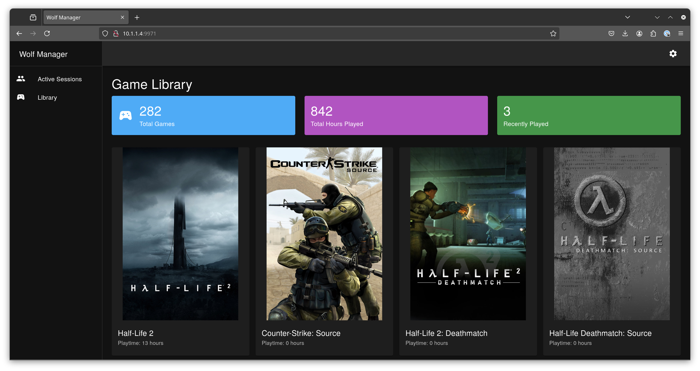

# WolfManager
A web interface for managing Wolf, providing a centralized dashboard for game library management and Wolf configuration.

## Features

### Implemented
- **Service Architecture**
  - Wolf API integration with BigInt client ID handling
  - Configuration management and persistence
  - Task management system with progress tracking
  - Logging system with multiple levels
  - Cache management for artwork
  - Steam integration for game library

- **UI Components**
  - Modern React component architecture
  - Material UI integration
  - Responsive design patterns
  - Theme support
  - Task monitoring interface
  - Configuration management UI
  - Log viewer

- **Core Functionality**
  - Steam game library integration
  - Game artwork fetching from SteamGridDB
  - User management interface
  - Admin settings configuration
  - Task management and monitoring
  - System log viewing
  - Basic client pairing workflow

### Work in Progress
- **Game Management**
  - [ ] SteamCMD integration for game installation
  - [ ] Automatic Wolf app configuration
  - [ ] Manual artwork search interface
  - [ ] Game state management

- **Wolf Integration**
  - [ ] Enhanced session management
  - [ ] Improved client pairing workflow
  - [ ] Multi-device state handling

- **Security**
  - [ ] Authentication system
  - [ ] Role-based access control
  - [ ] User state isolation

## Screenshots
Here are some screenshots of the current state of the project:


## Getting Started

### Prerequisites
- Docker installed and running
- Access to Wolf socket
- Configuration directory for persistence

### Quick Start

1. **Create Configuration Directory**
   ```bash
   mkdir -p /path/to/config
   ```

2. **Launch with Docker Compose**
   Create a `docker-compose.yml`:
   ```yaml
   version: '3.8'
   services:
     wolf-manager:
       image: ghcr.io/games-on-whales/wolfmanager:latest
       container_name: wolf-manager
       ports:
         - "9971:9971"
       volumes:
         - /path/to/config:/config
         - /var/run/docker.sock:/var/run/docker.sock:rw
         - /var/run/wolf:/var/run/wolf:rw
       environment:
         - NODE_ENV=production
       logging:
         driver: json-file
         options:
           max-size: "10m"
           max-file: "3"
           labels: "wolf-manager"
       restart: unless-stopped
   ```

   Then run:
   ```bash
   docker-compose up -d
   ```

3. **Alternative: Direct Docker Run**
   ```bash
   docker run --name wolf-manager \
     -p 9971:9971 \
     -v /path/to/config:/config \
     -v /var/run/docker.sock:/var/run/docker.sock:rw \
     -v /var/run/wolf:/var/run/wolf:rw \
     -e NODE_ENV=production \
     --log-driver json-file \
     --log-opt max-size=10m \
     --log-opt max-file=3 \
     --log-opt labels=wolf-manager \
     ghcr.io/games-on-whales/wolfmanager:latest
   ```

4. **Access the Interface**
   Open your browser and navigate to:
   ```
   http://localhost:9971
   ```

## Architecture
For detailed implementation information, see our [Architecture Documentation](docs/architecture/README.md).

## Known Issues
- Some artwork does not display for games, need a method for manually searching
- Authentication system needs to be implemented
- Some API endpoints need additional error handling

## FAQ

### How does this help with shared libraries?
Long term what we want to do is have it create an app entry for each game using the steam container we have and mount the specific game files into the container as a read only layer with the writable layer pointing back to the user profile path. The user experience would be launch moonlight and then select the game, it launches and game state data is saved in the profile path. Game updates are then handled by WolfManager using SteamCMD.

### How does multi-user work?
Wolf doesn't have the concept of users, just devices and where the state for each device is stored. Wolf does allow one state folder to work across multiple devices, so what we can do is have WolfManager create a user state folder for each user and then point all devices for that user to the same state folder. We can manage users and their pairing through Wolf Manager. But this is all future work and could change.

## Development

### Tools and Technology
- React with TypeScript
- Vite for building and development
- Material UI component library
- Docker for containerization
- Jest for testing

### Contributing
See our [Contributing Guide](CONTRIBUTING.md) for details on how to contribute to the project.

### Development Setup
For detailed setup instructions, see our [Development Guide](DEVELOPMENT.md).

# Known Issues
- Some artwork does not display for games, need a method for manually searching
- Authentication system needs to be implemented
- Some API endpoints need additional error handling

# FAQ
- Q: How does this help with shared libraries?
- A: Long term what we want to do is have it create an app entry for each game using the steam container we have and mount the specific game files into the container as a read only layer with the writable layer pointing back to the user profile path. The user experience would be launch moonlight and then select the game, it launches and game state data is saved in the profile path. Game updates are then handled by WolfManager using SteamCMD.

- Q: How does multi-user work?
- A: Wolf doesn't have the concept of users, just devices and where the state for each device is stored. Wolf does allow one state folder to work across multiple devices, so what we can do is have WolfManager create a user state folder for each user and then point all devices for that user to the same state folder. We can manage users and their pairing through Wolf Manager. But this is all future work and could change.

# Tools and Technology
Wolf Manager is built with React and TypeScript, featuring a modern component-based architecture. The project uses Vite for building and development. Development is assisted by Cursor AI for implementation while focusing on design, research, and problem-solving.  
