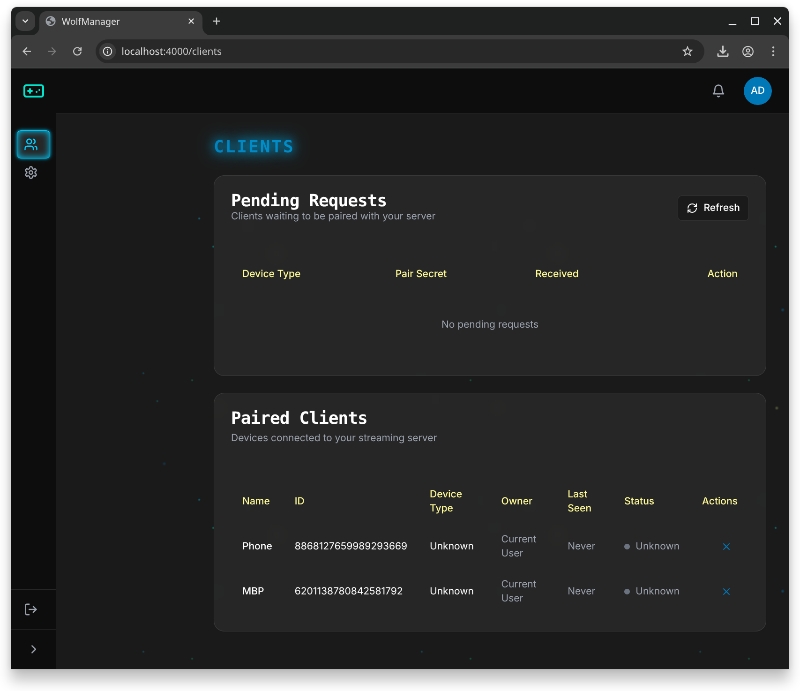
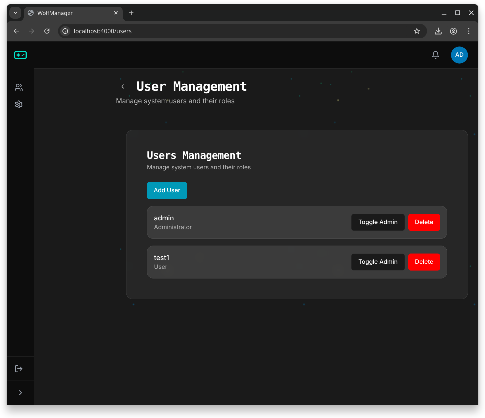
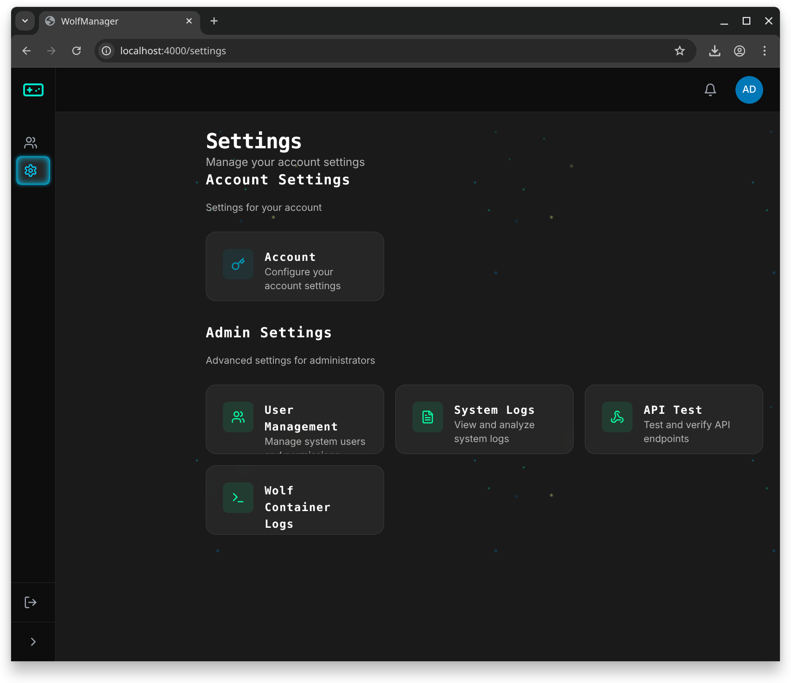
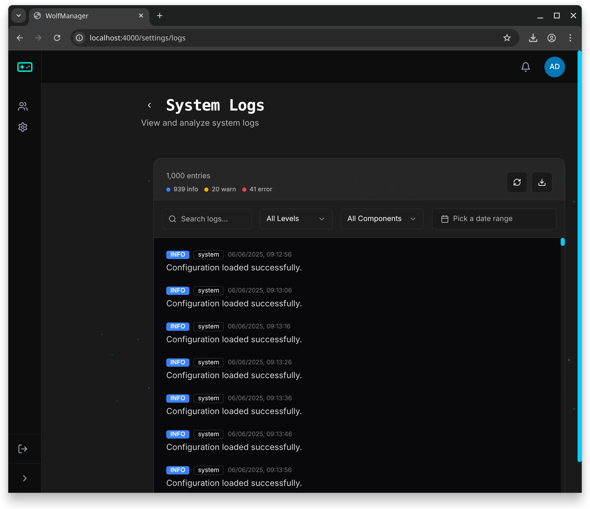

# WolfManager

A modern web interface for managing [Wolf](https://github.com/games-on-whales/wolf) - the self hosted game streaming solution that lets you stream your games to any device using the Moonlight client.

## Screenshots

<div align="center">
  <table>
    <tr>
      <td align="center">
        <a href="docs/images/clients.png">
          
        </a>
        <br>
        <em>Client Management</em>
        <br>
        <small>Manage paired devices and handle new client pairing requests</small>
      </td>
      <td align="center">
        <a href="docs/images/user_management.png">
          
        </a>
        <br>
        <em>User Management</em>
        <br>
        <small>Create and manage user accounts with role-based permissions</small>
      </td>
      <td align="center">
        <a href="docs/images/settings.png">
          
        </a>
        <br>
        <em>System Settings</em>
        <br>
        <small>Configure Wolf settings, metadata providers, and system preferences</small>
      </td>
      <td align="center">
        <a href="docs/images/systemlogs.png">
          
        </a>
        <br>
        <em>System Logs</em>
        <br>
        <small>Monitor Wolf container logs and troubleshoot issues in real-time</small>
      </td>
    </tr>
  </table>
</div>

## Quick Start

### Prerequisites

Before setting up WolfManager, you'll need a working Wolf installation.

**📖 [Wolf Deployment Guide](https://games-on-whales.github.io/wolf/stable/user/quickstart.html)**

> ⚠️ **IMPORTANT: Wolf Socket Must Be Enabled**
>
> WolfManager requires access to the Wolf UNIX socket to function correctly.
> If the socket is not available at `/var/run/wolf/wolf.sock`, **key features like session listing and client management will not work.**
>
> To enable the Wolf socket:
>
> 1. Set the `WOLF_SOCKET_PATH` environment variable in your Wolf container:
>
>    ```bash
>    -e WOLF_SOCKET_PATH=/var/run/wolf/wolf.sock
>    ```
> 2. Mount the socket location to the host machine:
>
>    ```bash
>    -v /var/run/wolf:/var/run/wolf
>    ```
> 3. Ensure the `wolf.sock` file is created inside the container at `/var/run/wolf/wolf.sock`.

---

### Running WolfManager with Docker Compose

The easiest way to deploy WolfManager is using Docker Compose. Create a `docker-compose.yml` file:

```yaml
services:
  wolfmanager:
    image: ghcr.io/games-on-whales/wolfmanager/wolfmanager:latest
    ports:
      - "3000:3000"
    environment:
      - NODE_ENV=production
      - NEXTAUTH_URL=http://localhost:3000
    volumes:
      - /var/run/wolf:/var/run/wolf              # Mount Wolf socket
      - /var/run/docker.sock:/var/run/docker.sock # Mount Docker socket
      - ./config:/app/config                      # Persist config directory
    restart: unless-stopped
```

```bash
docker-compose up -d
```

Access WolfManager at `http://localhost:3000`

> On first login use the following credentials:
>
> **Username:** admin
>
> **Password:** admin
>
> First time wizard will be triggered to prompt reset of password.

## Key Features

### ✅ Available Now

- **User Management**: Secure authentication with role-based access control
- **Smart Device Pairing**: 
  - Real-time pairing requests with Server-Sent Events (SSE)
  - Advanced duplicate client detection with clear error messages
  - Edit paired clients (name, controller type, mouse acceleration settings)
- **Log Monitoring**: Real-time Wolf container and application logs
- **API Integration**: Full Wolf API with interactive testing console

### 🚧 Coming Soon

- **Plugin System**: Community extensions for Steam, RomM, and other game libraries
- **Auto Wolf Launch**: Detect system and launch Wolf with optimal configuration

## Technology Stack

- **Frontend**: Next.js 14, React, Tailwind CSS, Shadcn UI
- **Backend**: Node.js, NextAuth.js, Drizzle ORM
- **Database**: SQLite/PostgreSQL/MySQL support
- **Real-time**: Server-Sent Events for live updates
- **Security**: Automatic secret generation, encrypted sessions

### Real-Time Events (SSE Relay)

WolfManager can stream Wolf client state changes to browsers in real time using a lightweight Server-Sent Events (SSE) relay. This replaces or augments fallback polling with sub-second updates.

| Var | Default | Description |
|-----|---------|-------------|
| SSE_RELAY_ENABLED | false | Enable internal relay that reads Wolf `/events` over the UNIX socket and broadcasts filtered events to authenticated users at `/api/events/stream`. |
| WOLF_SOCKET_PATH | /var/run/wolf/wolf.sock | Path to Wolf UNIX socket (must exist and be mounted; see Prerequisites section). |

**Operational Notes**:
- Auth required: only valid NextAuth sessions can connect (user-specific filtering).
- Events filtered so users only receive their own clients’ updates.
- Internal keep-alive heartbeats maintain a persistent connection (approx every 10s) and detect silent drops.
- Graceful reconnection logic; fallback periodic polling remains active for resilience.
- Disable if the Wolf socket is not mounted—relay will have no upstream source.

**Full Technical Details**: See [docs/features/real-time-sse-updates.md](docs/features/real-time-sse-updates.md)

## Development

### Recommended: Dev Container (VS Code)
```bash
git clone https://github.com/games-on-whales/wolfmanager
cd wolfmanager
code .  # Open in VS Code
# When prompted, click "Reopen in Container"
```

The dev container automatically:
- Installs all dependencies and tools
- Configures the development environment
- Mounts Wolf socket for API testing (note youll need a local wolf instance and check the devcontainer mounts)

**VS Code Tasks Available:**
- `Ctrl+Shift+P` → "Tasks: Run Task" → "Start Dev Server"
- Pre-configured launch configurations for debugging

### Local Development (Alternative)
```bash
npm install
npm run db:migrate
npm run dev  # Starts on http://localhost:3000
```

## Support

- **Documentation**: [Wolf Docs](https://games-on-whales.github.io/wolf/)
- **Issues**: [GitHub Issues](https://github.com/games-on-whales/wolfmanager/issues)
- **Discussions**: [GitHub Discussions](https://github.com/games-on-whales/wolfmanager/discussions)

## License

Open source software. See [LICENSE](LICENSE) for details.

---

*Built with ❤️ for the Wolf game streaming community*
