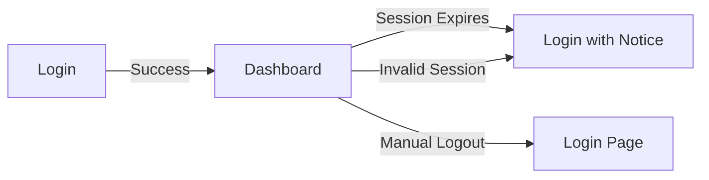

# Authentication Features

## Overview

WolfManager provides a secure and user-friendly authentication system with the following key features:

## 🔐 Security Features

- Secure session management
- Role-based access control (User/Admin)
- Protection against session hijacking
- Automatic session expiration

## 🚀 User Experience



### Key Features

1. **Smart Session Management**

   - Sessions last for 8 hours
   - Automatic logout on server restart
   - Remember last page visited

2. **User Notifications**

   - Clear session expiration notices
   - Friendly error messages
   - Automatic redirection

3. **First-Time Setup**
   - Special flow for new users
   - Password change requirement
   - Guided setup process

## 🛠️ Configuration

### Public Routes

The following routes are accessible without authentication:

- `/login`
- `/api/auth/*`

### Protected Routes

All other routes require authentication, with special cases for:

- `/admin/*` - Requires admin role
- `/users/*` - Requires admin role
- `/dashboard` - Requires any authenticated user

## 📱 Usage Examples

### Regular Login Flow

1. Visit any protected page
2. Redirect to login if not authenticated
3. Enter credentials
4. Redirect back to original page

### Session Expiration

1. Session expires after 8 hours
2. User sees friendly notification
3. Login to continue
4. Return to previous page

### Admin Access

1. Login with admin credentials
2. Access to additional routes
3. Special admin-only features
4. Enhanced management capabilities

## 🔍 Troubleshooting

Common scenarios and solutions:

1. **Session Expired**

   - Normal behavior after 8 hours
   - Simply log in again
   - Previous work is preserved

2. **Server Restart**

   - Sessions are cleared for security
   - Log in again to continue
   - Part of normal operation

3. **Access Denied**
   - Check user role
   - Verify URL permissions
   - Contact admin if needed

## 📚 Related Documentation

- [Technical Authentication Details](../technical/authentication.md)
- [User Guide](../guides/user-authentication.md)
- [Admin Guide](../guides/admin-features.md)

## For Developers

Quick implementation example:

```typescript
// Protect a route
export default function ProtectedPage() {
  const { data: session } = useSession({
    required: true,
    onUnauthenticated() {
      // Handle unauthenticated access
    },
  });

  return <div>Protected Content</div>;
}
```

For detailed technical implementation, see the [technical documentation](../technical/authentication.md).
