# WolfUI Data Flow Diagrams

This document provides detailed data flow diagrams for key processes in the WolfUI system.

## Authentication and Authorization

### Login Flow

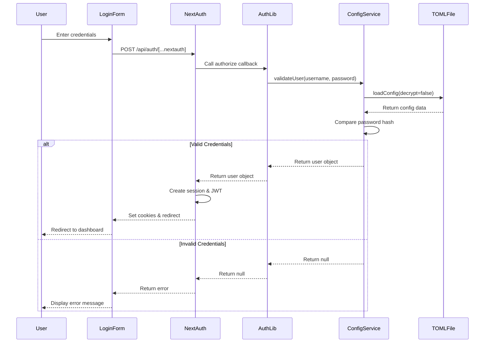

### Session Validation Flow

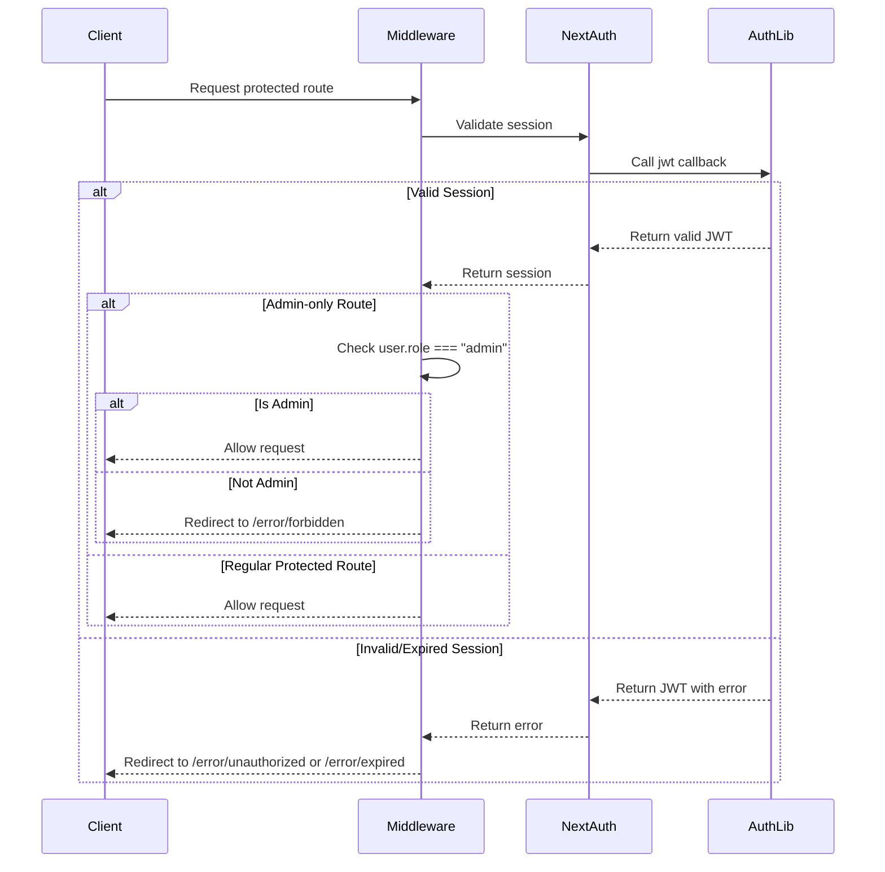

## Device Pairing

### Pending Pair Requests Flow

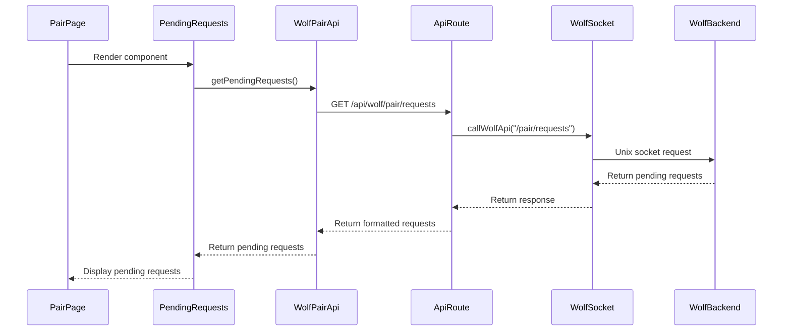

### Pairing Process Flow

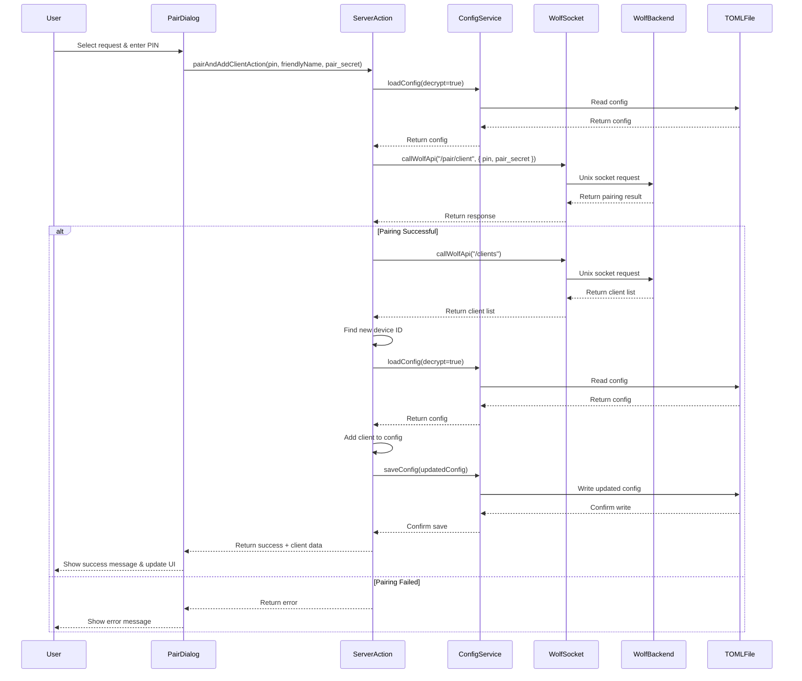

## Configuration Management

### SteamGridDB Settings Update Flow

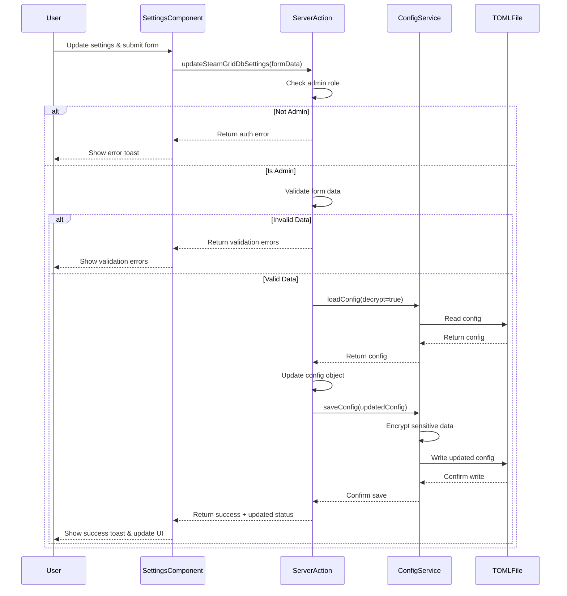

## Task Scheduling and Execution

### Task Scheduler Initialization Flow

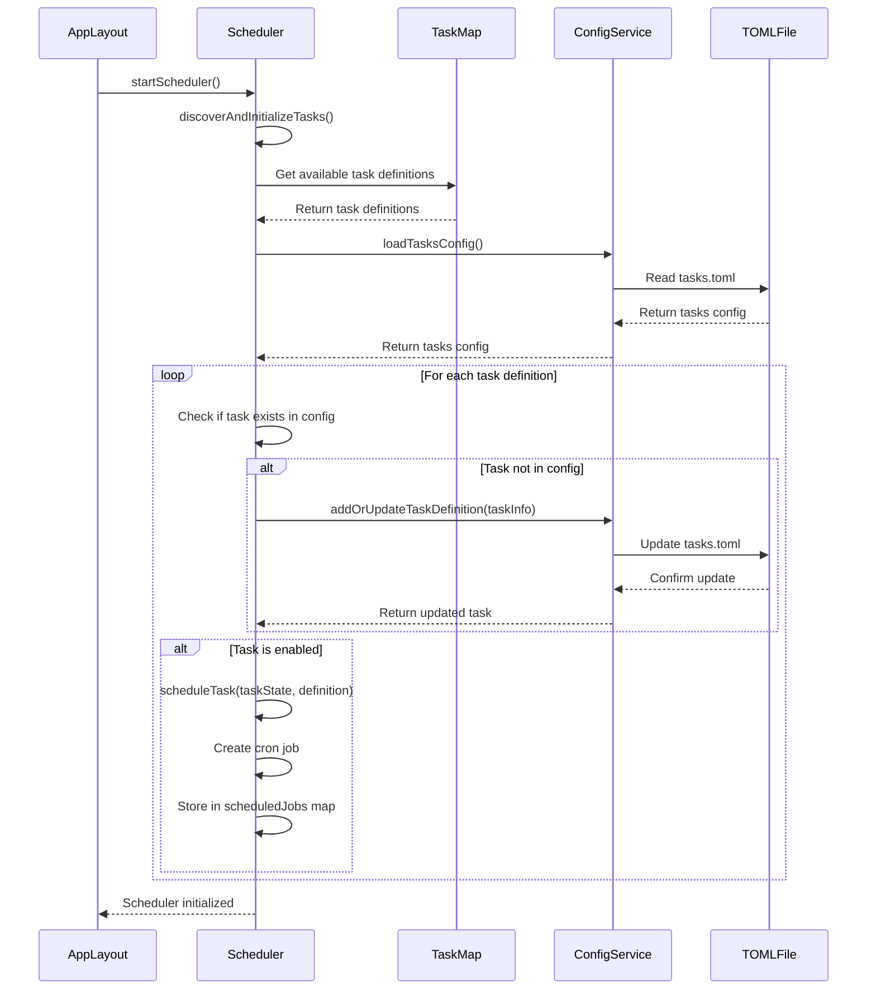

### Task Execution Flow

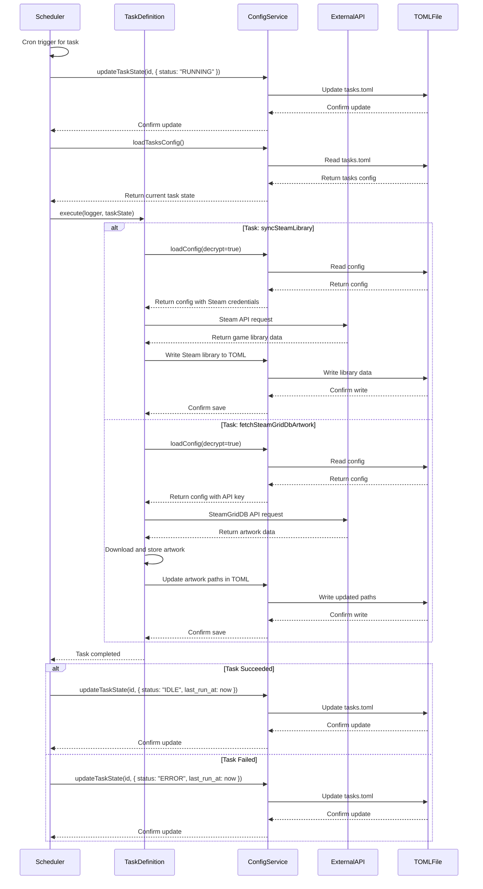

## Logging System

### Server-Side Logging Flow

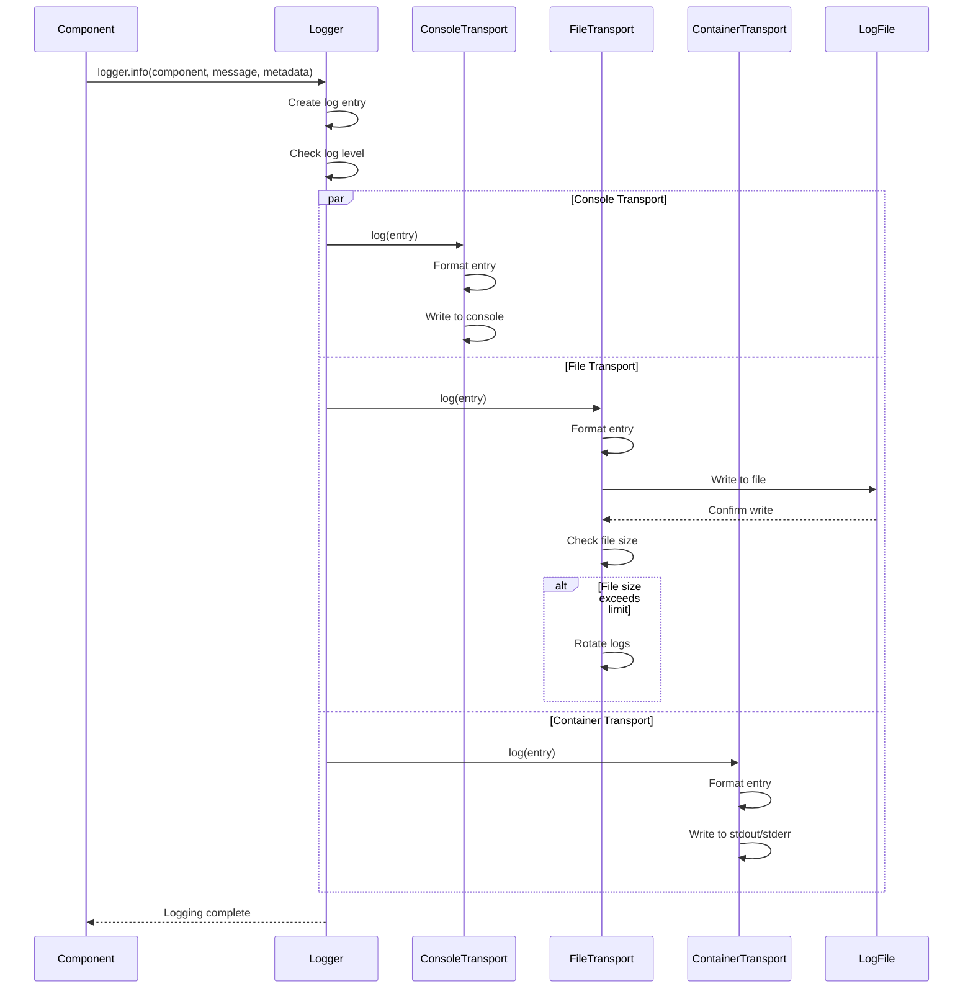

### Client-Side Logging Flow

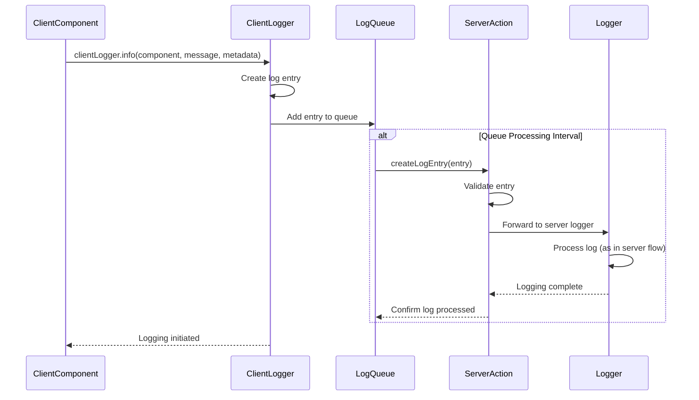

## Wolf Backend Communication

### Wolf API Request Flow

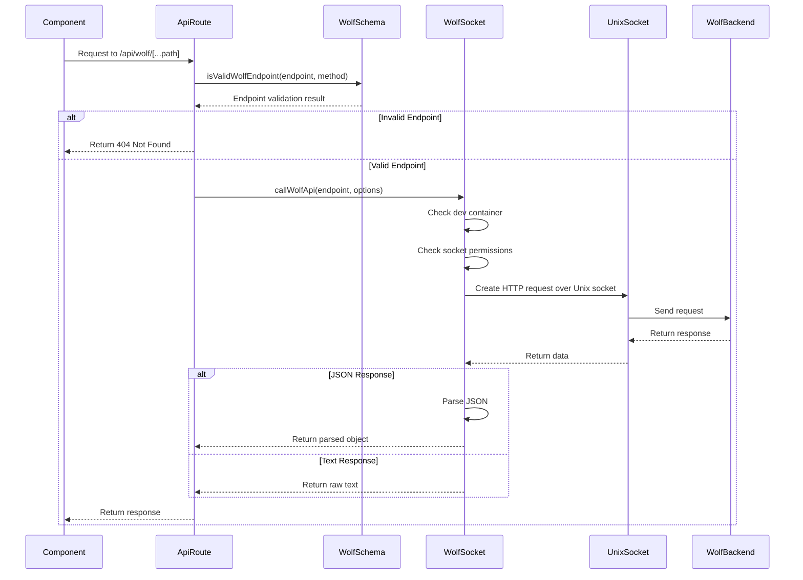

## External API Integration

### Steam Library Sync Flow

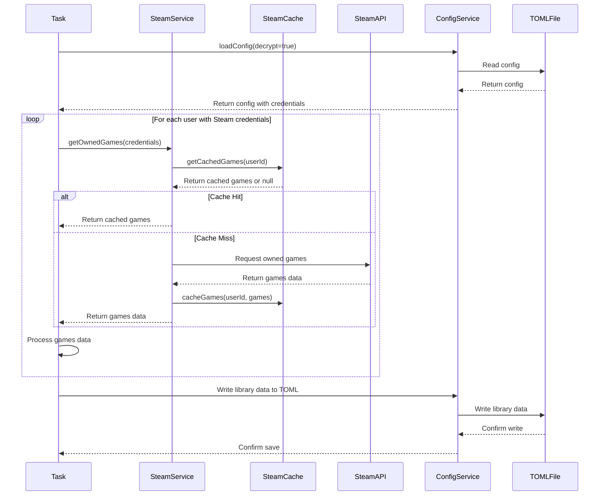

### SteamGridDB Artwork Fetch Flow

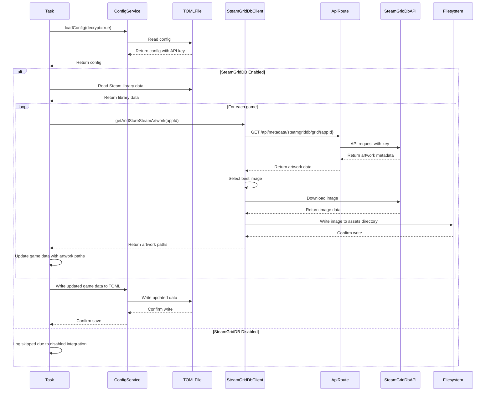
