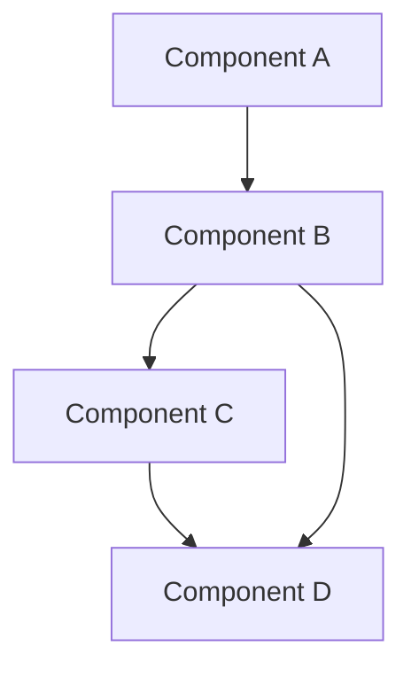

# WolfUI System Documentation

## Overview

This documentation provides a comprehensive overview of the WolfUI system architecture, components, data flows, design decisions, and constraints. It is intended for developers, maintainers, and anyone seeking to understand the technical aspects of the WolfUI system.

## Table of Contents

1. [Architecture Overview](architecture.md)

   - High-level system overview
   - Component interactions
   - Data flow diagrams
   - Design decisions and rationale
   - System constraints and limitations

2. [Component Interactions](components.md)

   - Core components
   - Next.js App Router structure
   - Server Components vs. Client Components
   - Server Actions
   - API Routes
   - Configuration Service
   - Wolf Socket Communication
   - Task Scheduler
   - Logging System
   - Component interaction examples

3. [Data Flow Diagrams](data-flow.md)

   - Authentication and authorization flows
   - Device pairing flows
   - Configuration management flows
   - Task scheduling and execution flows
   - Logging system flows
   - Wolf backend communication flows
   - External API integration flows

4. [Design Decisions and Rationale](design-decisions.md)

   - Next.js App Router architecture
   - TOML for configuration and data storage
   - Unix Domain Socket for Wolf backend communication
   - Server Actions for data mutations
   - Custom logging system
   - Background task scheduler
   - Centralized configuration management
   - Zod for validation
   - Authentication with NextAuth.js
   - UI component architecture
   - Error handling strategy

5. [System Constraints and Limitations](constraints.md)
   - Data storage constraints
   - Architectural constraints
   - Security constraints
   - Performance constraints
   - Maintenance constraints
   - Deployment constraints
   - Future improvement areas

## How to Use This Documentation

- Start with the [Architecture Overview](architecture.md) for a high-level understanding of the system.
- Explore [Component Interactions](components.md) to understand how different parts of the system work together.
- Review [Data Flow Diagrams](data-flow.md) to see how data moves through the system.
- Understand the reasoning behind key decisions in [Design Decisions and Rationale](design-decisions.md).
- Be aware of the system's limitations by reading [System Constraints and Limitations](constraints.md).

## Diagrams

This documentation includes various diagrams created using Mermaid. To view these diagrams properly, ensure your Markdown viewer supports Mermaid syntax. GitHub and many modern Markdown editors support Mermaid diagrams natively.

Example:

## Contributing to This Documentation

When updating this documentation:

1. Ensure all diagrams are created using Mermaid for consistency.
2. Update the relevant sections when making significant changes to the system.
3. Keep the documentation in sync with the actual implementation.
4. Add examples and code snippets where appropriate.
5. Consider adding new sections for major new features or components.
