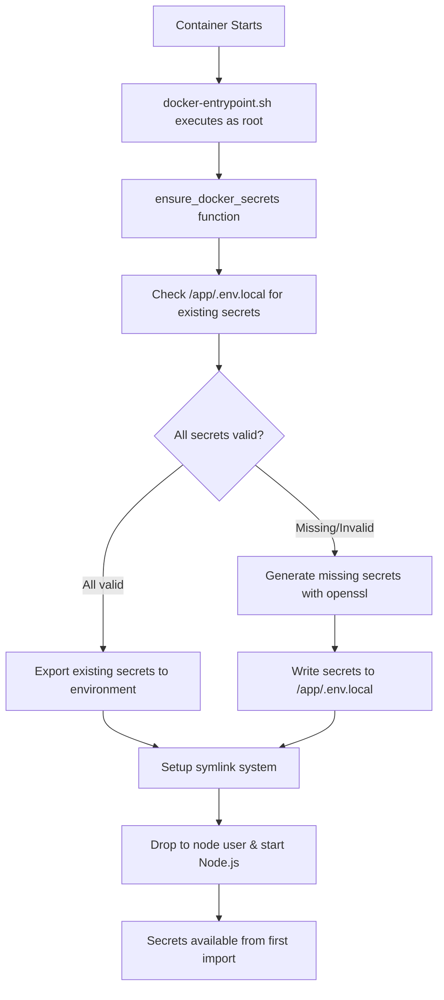

# Docker-Level Secret Generation

## Overview

This document describes the Docker-level secret generation implementation that ensures critical secrets (`NEXTAUTH_SECRET`, `INTERNAL_SERVICE_TOKEN`, `ENCRYPTION_KEY`) are generated and available **before** the Node.js application starts, eliminating timing issues.

## Problem Solved

### Previous Implementation Issue
- Secrets were generated during Node.js runtime initialization via `src/instrumentation.ts`
- This created a critical timing window where some components could fail before secrets were available
- Runtime generation happened **after** the application had already partially started

### Solution
- Secrets are now generated at the Docker container level using `openssl`
- Generation occurs **before** the Node.js application starts
- Secrets are available as environment variables from the very first import

## Implementation Architecture



## Components

### 1. Secret Generation Functions (`build/scripts/utils.sh`)

#### `generate_secret(length)`
- Uses `openssl rand -hex` for cryptographically secure generation
- Input: byte length (e.g., 32 bytes = 64 hex characters)
- Output: Hexadecimal string of specified length

#### `check_secret_in_file(file, secret_name, expected_length)`
- Validates if a secret exists in the .env.local file with correct length
- Returns 0 if valid, 1 if missing or wrong length
- Ensures idempotent behavior

#### `append_secret_to_file(file, secret_name, secret_value)`
- Safely adds secrets to .env.local file
- Removes existing entries to avoid duplicates
- Creates file if it doesn't exist

#### `ensure_docker_secrets()`
- Main orchestration function
- Generates all three required secrets if missing
- Exports secrets as environment variables
- Maintains idempotent behavior

### 2. Docker Integration (`build/docker-entrypoint.sh`)

Secret generation is integrated into the container startup sequence:

```bash
# Before symlink setup (line 47)
if ! ensure_docker_secrets; then
    wolf_log "ERROR: Failed to generate required secrets"
    exit 1
fi
```

### 3. Required Secrets

| Secret | Length | Purpose | Generation Command |
|--------|--------|---------|-------------------|
| `NEXTAUTH_SECRET` | 64 chars | NextAuth.js session encryption | `openssl rand -hex 32` |
| `INTERNAL_SERVICE_TOKEN` | 64 chars | Service-to-service communication | `openssl rand -hex 32` |
| `ENCRYPTION_KEY` | 32 chars | Application data encryption | `openssl rand -hex 16` |

## Benefits

### 1. **Timing Issue Resolution**
- ✅ Secrets available before Node.js startup
- ✅ No more initialization race conditions
- ✅ Components can safely use secrets from first import

### 2. **Security**
- ✅ Uses `openssl rand` for cryptographically secure generation
- ✅ Secrets generated with proper entropy
- ✅ No hardcoded fallback values

### 3. **Reliability**
- ✅ Idempotent behavior (only generates missing secrets)
- ✅ Validates secret length before acceptance
- ✅ Graceful error handling and logging

### 4. **Persistence**
- ✅ Uses existing symlink system for container restart persistence
- ✅ Secrets stored in `/app/config/.env.local` (mounted volume)
- ✅ Automatic migration of existing secrets

### 5. **Backward Compatibility**
- ✅ Existing `src/lib/env.ts` validation continues to work
- ✅ No changes to Node.js application code required
- ✅ Maintains same .env.local file format

## Implementation Timeline

```mermaid
gantt
    title Docker-Level Secret Generation Implementation
    dateFormat  X
    axisFormat %s
    
    section Phase 1
    Enhanced utils.sh with secret functions    :done, 1, 2
    
    section Phase 2  
    Modified docker-entrypoint.sh integration  :done, 2, 3
    
    section Phase 3
    Added openssl to Dockerfile                :done, 3, 4
    
    section Phase 4
    Updated documentation and examples         :done, 4, 5
```



## Testing

### Test Script
A comprehensive test script is available: `build/scripts/test-secret-generation.sh`

### Test Coverage
1. **Fresh Installation**: Generates all secrets from scratch
2. **Existing Secrets**: Preserves valid existing secrets (idempotent)
3. **Invalid Secrets**: Regenerates secrets with wrong lengths
4. **OpenSSL Availability**: Validates cryptographic generation capability

### Running Tests
```bash
# Run the test script
./build/scripts/test-secret-generation.sh
```

## Migration from Previous Implementation

### Automatic Migration
- No manual intervention required
- Existing secrets in `.env.local` are automatically detected and preserved
- Invalid or missing secrets are generated seamlessly

### Validation
The existing Node.js validation in `src/lib/env.ts` continues to work:
- Checks environment variables first (now available from Docker generation)
- Falls back to .env.local file reading if needed
- Maintains all existing diagnostic logging

## Troubleshooting

### Common Issues

#### 1. OpenSSL Not Available
```
ERROR: openssl not found. Cannot generate secure secrets.
```
**Solution**: Ensure `openssl` is installed in the Docker image (added to Dockerfile)

#### 2. Permission Issues
```
ERROR: Failed to write to .env.local file
```
**Solution**: Ensure proper file permissions and ownership in container

#### 3. Invalid Secret Lengths
```
ERROR: Generated secret has incorrect length
```
**Solution**: Check openssl installation and entropy availability

### Debug Logging
The implementation includes comprehensive logging:
- Secret generation status
- File operations
- Environment variable exports
- Error conditions with detailed messages

## Security Considerations

### 1. **Secret Storage**
- Secrets are stored in `.env.local` file with restricted permissions
- File is owned by `node:node` user in container
- No secrets logged in plaintext

### 2. **Generation Method**
- Uses `openssl rand -hex` for cryptographically secure random generation
- Proper entropy source ensures unpredictable secrets
- No predictable patterns or weak generation

### 3. **Environment Variables**
- Secrets exported to environment for immediate Node.js access
- Environment variables cleared on container shutdown
- No persistence in container environment across restarts

## Future Considerations

### 1. **Secret Rotation**
- Current implementation is idempotent (preserves existing secrets)
- Future enhancement could add rotation capability
- Would require coordination with active sessions

### 2. **External Secret Management**
- Implementation allows for external secret injection
- Secrets provided via environment variables override generation
- Compatible with Kubernetes secrets, Docker secrets, etc.

### 3. **Monitoring**
- Current implementation includes comprehensive logging
- Future enhancement could add metrics and health checks
- Integration with monitoring systems for secret generation events