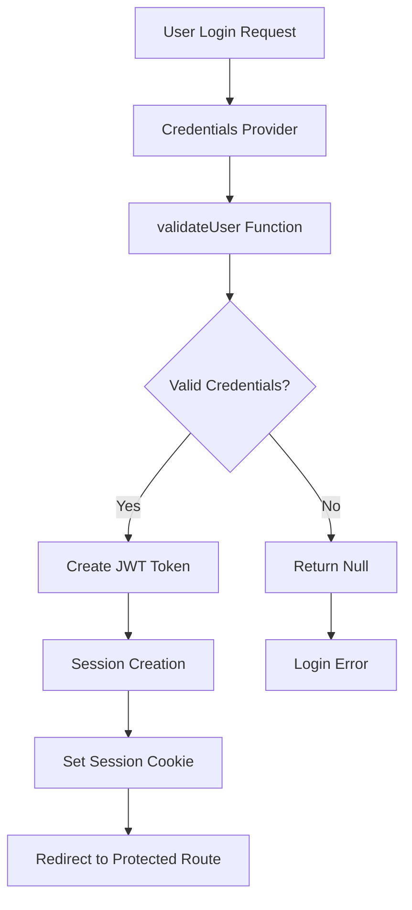

# Authentication & Session Management Architecture

## Overview

WolfManager implements a robust authentication and session management system using NextAuth.js v4 with JWT tokens and custom cookie configuration. The system is designed to handle both local and remote network access while maintaining security and providing comprehensive logging for debugging.

## Architecture Components

### 1. Core Authentication Configuration

The authentication system is centralized in [`src/lib/auth.ts`](../../src/lib/auth.ts) and consists of:

- **NextAuth.js v4** with JWT strategy
- **Credentials Provider** for username/password authentication
- **Custom Cookie Configuration** for cross-host compatibility
- **Comprehensive Logging** for debugging and monitoring

### 2. Authentication Flow



## Key Components

### 1. Authentication Configuration (`src/lib/auth.ts`)

#### Cookie Configuration
```typescript
cookies: {
  sessionToken: {
    name: `next-auth.session-token`,
    options: {
      httpOnly: true,           // Prevent XSS attacks
      sameSite: "lax",         // Allow cross-host requests (was "strict")
      path: "/",               // Available across entire application
      secure: false,           // Allow non-HTTPS for development/internal networks
      domain: undefined,       // Allow cookies across different hosts
    },
  },
}
```

**Key Changes for Remote Access:**
- `sameSite: "lax"` - Allows session cookies to work when accessing from different network hosts
- `secure: false` - Permits non-HTTPS connections for internal network deployment
- `domain: undefined` - Enables cookie sharing across different host origins

#### JWT Token Structure
```typescript
interface JWT {
  id: string;                    // User ID
  role?: string;                 // User role (admin/user)
  requiresFirstTimeSetup: boolean; // First-time setup flag
  error?: "SessionExpired";      // Session expiration marker
  exp?: number;                  // Token expiration timestamp
}
```

#### Session Structure
```typescript
interface Session {
  user: {
    id: string;
    name: string;
    role?: string;
  };
  requiresFirstTimeSetup: boolean;
  error?: "SessionExpired";
}
```

### 2. Middleware Protection (`src/middleware.ts`)

The middleware provides route-level authentication and authorization:

#### Route Categories
- **Public Paths**: No authentication required
  - `/`, `/login`, `/register`, `/first-time-setup`
  - `/api/auth`, `/_next`, `/favicon.ico`
  - Error pages: `/error/unauthorized`, `/error/forbidden`, `/error/expired`

- **Admin Paths**: Require admin role
  - `/admin`, `/users`, `/api/users`, `/api/admin`
  - `/api/system`, `/api/wolf/admin`, `/settings/api-test`

- **Protected API Paths**: Require authentication
  - `/api/user`, `/api/wolf`, `/api/libraries`, `/api/settings`

#### Authentication Flow in Middleware
```typescript
// 1. Extract token from request
const token = req.nextauth.token;

// 2. Check for valid session
if (!token || token.error === "SessionExpired") {
  // API routes: Return 401
  // Web routes: Redirect to /error/unauthorized
}

// 3. Enforce first-time setup
if (token.requiresFirstTimeSetup && pathname !== "/first-time-setup") {
  // Redirect to first-time setup
}

// 4. Check admin permissions
if (adminPaths.includes(pathname) && token.role !== "admin") {
  // API routes: Return 403
  // Web routes: Redirect to /error/forbidden
}
```

### 3. Server-Side Session Validation

#### Server Actions Pattern
All server actions use a consistent authentication pattern:

```typescript
async function getAuthenticatedSession() {
  const session = await getServerSession(authOptions);
  if (!session?.user) {
    await logger.warn(LogComponent.WOLF_UI, "Action attempted without authentication");
    return null;
  }
  return session;
}

export async function someServerAction() {
  const session = await getAuthenticatedSession();
  if (!session) {
    return createErrorResponse(
      API_ERROR_CODES.UNAUTHORIZED,
      "Authentication required"
    );
  }
  // Proceed with authenticated action
}
```

#### API Route Pattern
API routes follow a similar authentication pattern:

```typescript
export async function GET(request: NextRequest) {
  const session = await getServerSession(authOptions);
  if (!session?.user) {
    return NextResponse.json({ error: "Unauthorized" }, { status: 401 });
  }
  // Proceed with authenticated API logic
}
```

### 4. Socket Permission System (`src/lib/auth/socket-permissions.ts`)

The application includes a sophisticated socket permission system for Wolf and Docker socket access:

#### Permission Levels
- **ADMIN**: Full administrative access to all socket operations
- **READ_ONLY**: Read-only access to socket operations
- **NONE**: No socket access

#### Socket Types
- **WOLF**: Wolf application socket (users get read-only, admins get full access)
- **DOCKER**: Docker daemon socket (admin-only access)

#### Operation Types
- **READ**: GET requests, log reading
- **WRITE**: POST, PUT, PATCH requests
- **ADMIN**: DELETE requests, administrative operations

```typescript
export async function validateSocketAccess(
  session: Session | null,
  socketType: SocketType,
  operation: SocketOperation = SOCKET_OPERATIONS.READ
): Promise<boolean> {
  // Validate session
  if (!session?.user || session.error === "SessionExpired") {
    return false;
  }

  // Admin users have full access
  if (session.user.role === "admin") {
    return true;
  }

  // Apply granular permissions for regular users
  switch (socketType) {
    case SOCKET_TYPES.WOLF:
      return operation !== SOCKET_OPERATIONS.ADMIN;
    case SOCKET_TYPES.DOCKER:
      return false; // Docker access requires admin
  }
}
```

## Session Management

### 1. Session Lifecycle

#### Session Creation
1. User submits credentials via login form
2. Credentials provider validates against user database
3. JWT token created with user information
4. Session cookie set with cross-host configuration
5. User redirected to protected route

#### Session Validation
1. Middleware extracts JWT token from request
2. Token validated for expiration and integrity
3. Session object populated with user data
4. Route access determined based on user role

#### Session Expiration
- **Max Age**: 8 hours
- **Update Age**: 1 hour (token refreshed if older than 1 hour)
- **Expired Sessions**: Automatically redirect to login with error message

### 2. Cross-Host Session Sharing

The system is specifically configured to handle remote network access:

#### Problem Solved
- **Issue**: Session cookies with default `sameSite: "strict"` prevented authentication when accessing the application from different network hosts
- **Solution**: Updated to `sameSite: "lax"` and `domain: undefined` to allow cross-host cookie sharing

#### Security Considerations
- `httpOnly: true` prevents XSS attacks
- `secure: false` allows internal network deployment without HTTPS
- `path: "/"` restricts cookies to application scope
- JWT tokens include expiration timestamps for security

## Client-Side Session Management

### 1. Session Provider (`src/components/providers/session-provider.tsx`)

Wraps the application with NextAuth session context:

```typescript
<NextAuthSessionProvider>
  <SessionLogger />
  {children}
</NextAuthSessionProvider>
```

### 2. Session Hooks

Components use NextAuth hooks for session access:

```typescript
import { useSession } from "next-auth/react";

function Component() {
  const { data: session, status } = useSession();
  
  if (status === "loading") return <Loading />;
  if (status === "unauthenticated") redirect("/login");
  
  return <AuthenticatedContent session={session} />;
}
```

### 3. Protected Route Components

#### WithAuth Component
```typescript
function WithAuth({ children, requireAdmin = false }: WithAuthProps) {
  const { data: session, status } = useSession();

  if (status === "loading") return <div>Loading...</div>;
  if (status === "unauthenticated") redirect("/error/unauthorized");
  if (requireAdmin && session?.user?.role !== "admin") {
    redirect("/error/forbidden");
  }

  return <>{children}</>;
}
```

## Logging and Debugging

### 1. Comprehensive Authentication Logging

The system includes extensive logging throughout the authentication flow:

#### JWT Callback Logging
```typescript
logger.debug(LogComponent.AUTH, "DIAGNOSIS: JWT callback - NEXTAUTH_URL check", {
  nextauthUrl: process.env.NEXTAUTH_URL,
  nodeEnv: process.env.NODE_ENV,
  hasUser: !!user,
  hasTrigger: !!trigger,
  timestamp: new Date().toISOString(),
});
```

#### Session Validation Logging
```typescript
logger.debug(LogComponent.AUTH, "DIAGNOSIS: Session validated successfully", {
  userId: token.id,
  userName: token.name,
  userRole: token.role,
  requiresFirstTimeSetup: token.requiresFirstTimeSetup,
  tokenExpiry: token.exp ? new Date(token.exp * 1000).toISOString() : undefined,
  timestamp: new Date().toISOString(),
});
```

#### Middleware Logging
```typescript
await logger.debug(LogComponent.AUTH, "DIAGNOSIS: Middleware called", {
  pathname,
  hasToken: !!token,
  userId: token?.id,
  userName: token?.name,
  userRole: token?.role,
  requiresFirstTimeSetup: token?.requiresFirstTimeSetup,
  origin: req.nextUrl.origin,
  host: req.nextUrl.host
});
```

### 2. Error Handling and Recovery

#### Session Expiration Handling
```typescript
if (token.error === "SessionExpired") {
  return {
    ...session,
    error: "SessionExpired",
    expires: new Date(0).toISOString(),
  };
}
```

#### Automatic Logout on Expiration
```typescript
if (error === "SessionExpired") {
  showToast.error(
    "Session Expired",
    "Your session has expired. Please log in again."
  );
}
```

## Environment Configuration

### 1. Required Environment Variables

```bash
# NextAuth Configuration
NEXTAUTH_SECRET=<64-character-secure-key>
NEXTAUTH_URL=<application-url>  # Optional, auto-detected in development

# Encryption
ENCRYPTION_KEY=<32-character-key>
```

### 2. Container Deployment Configuration

For Docker deployment with port mapping (e.g., 4000→3000):

```yaml
# docker-compose.yml
environment:
  - NEXTAUTH_URL=http://10.1.1.20:4000  # External access URL
  - NODE_ENV=production
ports:
  - "4000:3000"
```

## Security Features

### 1. Authentication Security
- **Bcrypt Password Hashing**: Secure password storage
- **JWT Token Signing**: Cryptographically signed tokens
- **Session Expiration**: Automatic token expiration and refresh
- **CSRF Protection**: Built-in NextAuth CSRF protection

### 2. Authorization Security
- **Role-Based Access Control**: Admin vs user permissions
- **Route-Level Protection**: Middleware-enforced access control
- **API Endpoint Protection**: Consistent authentication across all APIs
- **Socket Permission System**: Granular permissions for system operations

### 3. Network Security
- **HttpOnly Cookies**: Prevent XSS attacks
- **SameSite Configuration**: Control cross-site request behavior
- **Secure Headers**: Security headers via Next.js configuration
- **Rate Limiting**: Built-in rate limiting for socket operations

## Troubleshooting

### 1. Common Issues

#### Remote Access UNAUTHORIZED Errors
- **Symptom**: Authentication works on localhost but fails from remote machines
- **Cause**: Restrictive cookie configuration
- **Solution**: Ensure `sameSite: "lax"` and `domain: undefined` in cookie config

#### Session Not Persisting
- **Symptom**: User gets logged out on page refresh
- **Cause**: Cookie not being set or read properly
- **Solution**: Check NEXTAUTH_URL configuration and cookie settings

#### First-Time Setup Loop
- **Symptom**: User stuck in first-time setup redirect
- **Cause**: `requiresFirstTimeSetup` flag not being cleared
- **Solution**: Verify password change updates user record

### 2. Debugging Tools

#### Enable Debug Logging
```typescript
// Add to environment
DEBUG=true
```

#### Check Session State
```typescript
// In browser console
console.log(await fetch('/api/auth/session').then(r => r.json()));
```

#### Verify Cookie Settings
```typescript
// Check browser developer tools > Application > Cookies
// Look for 'next-auth.session-token'
```

## Future Considerations

### 1. Potential Improvements
- **OAuth Provider Integration**: Add GitHub, Google, etc.
- **Multi-Factor Authentication**: TOTP or SMS-based 2FA
- **Session Management UI**: Admin interface for session management
- **Advanced Rate Limiting**: Per-user, per-endpoint rate limiting

### 2. Security Enhancements
- **Certificate-Based Authentication**: For production deployments
- **IP Whitelisting**: Restrict access to specific network ranges
- **Audit Logging**: Comprehensive audit trail for security events
- **Session Analytics**: Monitor session patterns and anomalies

## Conclusion

The WolfManager authentication system provides a robust, secure, and debuggable foundation for user authentication and session management. The system successfully handles both local and remote network access while maintaining security best practices and providing comprehensive logging for troubleshooting.

The recent resolution of the remote access UNAUTHORIZED error demonstrates the system's flexibility and the importance of proper cookie configuration for cross-host compatibility in containerized deployments.