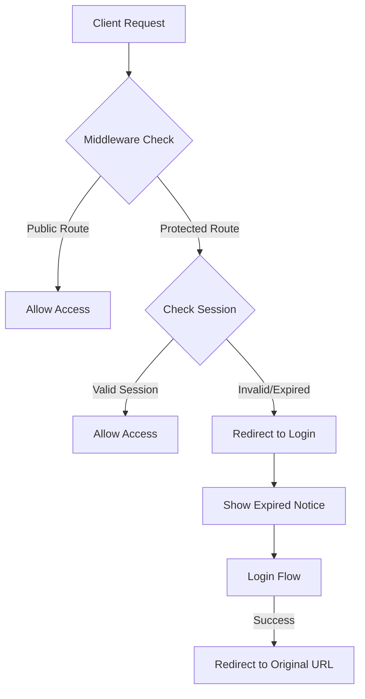
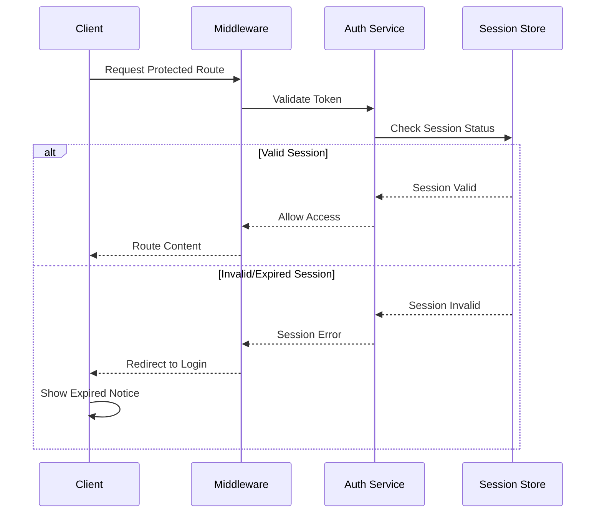
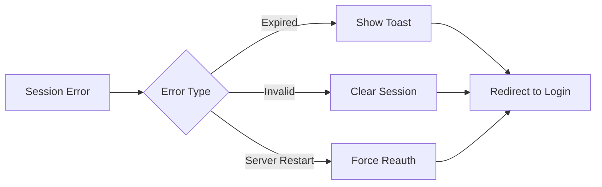

# Authentication System Documentation

## Overview

The WolfUI authentication system uses Next-Auth with JWT strategy and implements a robust session management system with server-side validation and client-side handling of expired sessions.

## Architecture



## Components

### 1. Session Management

The session system uses three main components:

- JWT tokens with server instance tracking
- In-memory session store
- Middleware-based validation

```typescript
// Key session configuration
{
  strategy: "jwt",
  maxAge: 8 * 60 * 60, // 8 hours
  updateAge: 1 * 60 * 60, // 1 hour
}
```

### 2. Session Validation Flow



### 3. Session Invalidation Triggers

Sessions can be invalidated by:

1. Server restart
2. Session timeout (8 hours)
3. Manual logout
4. Token expiration

## Implementation Details

### Middleware Protection (`src/middleware.ts`)

The middleware handles route protection and session validation:

```typescript
export default withAuth(async function middleware(req) {
  const token = req.nextauth.token;

  // Check for expired or invalid session
  if (!token || token.error === "SessionExpired") {
    const url = new URL("/login", req.url);
    url.searchParams.set("error", "SessionExpired");
    url.searchParams.set("callbackUrl", pathname);
    return NextResponse.redirect(url);
  }

  // Additional route checks...
});
```

### Client-Side Handling (`src/app/login/components/login-client.tsx`)

The login client handles session errors and notifications:

```typescript
useEffect(() => {
  if (error === "SessionExpired") {
    clientLogger.info(
      LogComponent.AUTH,
      "Session expired - showing notification"
    );
    toast.error("Session Expired", {
      description: "Your session has expired. Please log in again.",
    });
  }
}, [error]);
```

## Security Considerations

1. **Token Security**

   - JWTs are encrypted using NEXTAUTH_SECRET
   - Tokens include server instance validation
   - Sensitive data is excluded from tokens

2. **Session Validation**

   - Server-side validation on every request
   - In-memory session store prevents token reuse
   - Automatic cleanup of expired sessions

3. **Route Protection**
   - Public routes are explicitly defined
   - Admin routes have additional role checks
   - All other routes require authentication

## Error Handling



## Logging

The system implements comprehensive logging:

```typescript
// Example log events
clientLogger.info(LogComponent.AUTH, "Session expired");
clientLogger.debug(LogComponent.AUTH, "Session validated");
clientLogger.warn(LogComponent.AUTH, "Invalid session detected");
```

## For AI Agents

### Key Concepts

- `SESSION_EXPIRED`: Error type indicating session termination
- `activeSessions`: In-memory Map storing valid session IDs
- `SERVER_START_TIME`: Timestamp used for session validation

### Important Files

1. `src/lib/auth.ts`: Core authentication configuration
2. `src/middleware.ts`: Route protection and session validation
3. `src/app/login/components/login-client.tsx`: Client-side error handling

### Session States

1. `authenticated`: Valid session with active token
2. `unauthenticated`: No session or expired token
3. `loading`: Session validation in progress

### Validation Rules

1. All non-public routes require valid session
2. Admin routes require role="admin"
3. Sessions invalidate on server restart
4. Maximum session duration: 8 hours

## Testing Authentication

To test the authentication system:

1. **Session Expiration**

   ```bash
   # Restart the server
   npm run dev
   # Existing sessions should be invalidated
   ```

2. **Protected Routes**

   ```typescript
   // Should redirect to login if session is invalid
   await fetch("/api/protected-route");
   ```

3. **Admin Access**
   ```typescript
   // Should check user.role === 'admin'
   await fetch("/api/admin-route");
   ```
