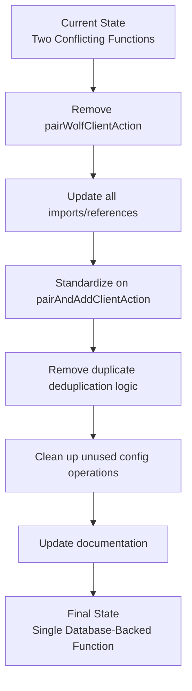

# Pairing Functions Consolidation Plan

## Overview

This document outlines the architectural cleanup plan for consolidating duplicate pairing functions in the WolfUI codebase. The goal is to eliminate conflicting implementations and standardize on a single, database-backed pairing approach.

## Current State Analysis

### Conflicting Functions Identified

#### 1. `pairWolfClientAction()` (LEGACY - TO BE REMOVED)
- **Location**: `src/app/actions/wolf-actions.ts:784-1058`
- **Storage**: Config files only (TOML-based)
- **Status**: Not currently used in UI
- **Issues**: 
  - ❌ Conflicts with database-first architecture
  - ❌ Uses deprecated config file storage
  - ❌ Duplicates functionality

#### 2. `pairAndAddClientAction()` (CURRENT STANDARD)
- **Location**: `src/app/clients/actions.ts:809-1115`
- **Storage**: Database (correct approach)
- **Status**: Currently used in UI (`ClientPageContent.tsx`)
- **Benefits**:
  - ✅ Follows database-first architecture
  - ✅ Proper error handling and logging
  - ✅ Active and maintained

### Duplicate Detection Functions

#### 1. `deduplicateWolfClients()` (TO BE REMOVED)
- **Location**: `src/app/actions/wolf-actions.ts:110-130`
- **Usage**: Only used by `pairWolfClientAction()`
- **Issues**: Simple deduplication logic, superseded by better implementation

#### 2. Enhanced deduplication in `getWolfClients()` (TO KEEP)
- **Location**: `src/app/clients/actions.ts:167-250`
- **Features**:
  - Comprehensive deduplication
  - Automatic cleanup via unpair requests
  - Better logging and error handling

## Consolidation Strategy

### Architecture Flow

### Implementation Phases

#### Phase 1: Function Removal and Standardization
1. Remove `pairWolfClientAction()` completely
2. Update all imports and references
3. Ensure `pairAndAddClientAction()` is the only pairing function

#### Phase 2: Code Cleanup
1. Remove duplicate deduplication logic
2. Clean up unused config file operations
3. Remove helper functions only used by removed code

#### Phase 3: Architecture Improvements
1. Standardize on database-first approach
2. Consolidate deduplication logic
3. Maintain automatic cleanup capabilities

## Detailed Implementation Plan

### Step 1: Functions to Remove

#### Primary Function Removal
- **`pairWolfClientAction()`** (lines 784-1058)
  - Complete function removal
  - No current UI usage detected
  - Risk: Low

#### Supporting Function Removal
- **`deduplicateWolfClients()`** (lines 110-130)
  - Only used by `pairWolfClientAction()`
  - Superseded by better logic in `getWolfClients()`

- **`extractUniqueClientIds()`** (lines 441-450)
  - Helper function only used by `pairWolfClientAction()`
  - Safe to remove with parent function

### Step 2: Files to Modify

#### Primary Changes
1. **`src/app/actions/wolf-actions.ts`**
   - Remove `pairWolfClientAction()` function
   - Remove `deduplicateWolfClients()` function  
   - Remove `extractUniqueClientIds()` function
   - Update exports list

2. **`src/app/clients/actions.ts`**
   - Keep `pairAndAddClientAction()` as the standard
   - Maintain enhanced deduplication in `getWolfClients()`
   - Ensure robust error handling

#### Documentation Updates
1. Update function comments to clarify standard approach
2. Remove references to config file-based pairing
3. Update API documentation if applicable

### Step 3: Testing and Validation

#### Functional Testing
- [ ] Verify client pairing works via `pairAndAddClientAction()`
- [ ] Test duplicate detection and cleanup
- [ ] Confirm database operations function correctly

#### Integration Testing
- [ ] Test full pairing workflow from UI
- [ ] Verify error handling and logging
- [ ] Ensure no config files are created/modified

## Risk Assessment

### Low Risk Items
- ✅ `pairWolfClientAction()` appears unused in current UI
- ✅ Database-backed approach is already working
- ✅ No external API dependencies on removed functions

### Mitigation Strategies
1. **Gradual Removal**: Remove functions incrementally with testing
2. **Version Control**: Keep removed code in git history for rollback
3. **Monitoring**: Watch logs for unexpected errors post-removal

## Expected Benefits

### Simplified Architecture
- Single source of truth for client pairing
- Consistent database-first approach
- Reduced code duplication

### Improved Maintainability
- Fewer functions to maintain
- Clearer code paths
- Better error handling

### Enhanced Reliability
- Superior duplicate detection and cleanup
- Consistent data storage
- Better logging and debugging

## Success Criteria

- [ ] `pairWolfClientAction()` completely removed
- [ ] All client pairing uses `pairAndAddClientAction()`
- [ ] No config file operations for client data
- [ ] Enhanced deduplication logic preserved
- [ ] All tests pass
- [ ] No broken imports or references
- [ ] Documentation updated

## Current Usage Analysis

### Active Usage
- **`pairAndAddClientAction()`**: Used in `src/app/clients/components/ClientPageContent.tsx`
- **Enhanced deduplication**: Used in `getWolfClients()` function

### Unused/Legacy Code
- **`pairWolfClientAction()`**: No active usage found
- **`deduplicateWolfClients()`**: Only used by function being removed
- **Config file pairing**: Deprecated approach

## Implementation Notes

### Database Schema
The current database schema supports the consolidation:
- Client devices stored in database tables
- User associations properly maintained
- Wolf client ID mapping preserved

### Backward Compatibility
- No backward compatibility needed for config files
- Database approach is the current standard
- No external integrations depend on removed functions

## Post-Implementation Verification

### Code Quality Checks
1. No unused imports remain
2. All function calls resolve correctly
3. No dead code paths exist
4. Consistent error handling throughout

### Functional Verification
1. Client pairing workflow functions end-to-end
2. Duplicate detection and cleanup works
3. Database operations complete successfully
4. UI interactions work as expected

---

**Document Status**: Draft  
**Created**: 2025-01-06  
**Last Updated**: 2025-01-06  
**Next Review**: After implementation completion